# Crowdin 多语言翻译指南

本项目使用 Crowdin 管理多语言翻译，支持简体中文、英文和繁体中文（港澳台）三个版本。

## 支持的语言

- 🇨🇳 **简体中文** (`zh`) - 默认语言，作为翻译源
- 🇺🇸 **英文** (`en`) - 国际市场
- 🇹🇼 **繁体中文** (`zh-TW`) - 港澳台地区

## 快速开始

### 1. 注册 Crowdin 账号

访问 [Crowdin.com](https://crowdin.com/) 注册免费账号。

### 2. 创建项目

1. 登录 Crowdin 后，点击 "Create Project"
2. 选择项目类型：**File-based**
3. 填写项目信息：
   - Project name: `BrainCo Website`
   - Source language: `Chinese Simplified`
   - Target languages: 
     - `English`
     - `Chinese Traditional, Taiwan`

### 3. 获取 API 凭证

1. 进入项目设置 → Settings → API
2. 复制 **Project ID**
3. 前往账户设置 → API → 生成 **Personal Access Token**

### 4. 配置本地环境

在项目根目录创建 `.env.local` 文件：

```bash
# Crowdin 配置
CROWDIN_PERSONAL_TOKEN=your_personal_token_here
```

然后更新 `crowdin.yml` 文件中的 `project_id`：

```yaml
project_id: "your_project_id"
```

### 5. 上传源文件

```bash
# 上传简体中文源文件到 Crowdin
npm run crowdin:upload
```

### 6. 在 Crowdin 上翻译

1. 登录 Crowdin 项目
2. 选择目标语言（英文或繁体中文）
3. 开始翻译或邀请团队成员协作

#### 翻译技巧

**对于英文翻译：**
- 产品名称保持原文
- 技术术语使用行业标准翻译
- 保持专业和正式的语气

**对于繁体中文翻译：**
- 使用台湾惯用词汇（如"軟體"而非"软件"）
- 注意港澳台的用语习惯
- 专业术语参考台湾标准

### 7. 下载翻译

```bash
# 从 Crowdin 下载最新翻译
npm run crowdin:download
```

### 8. 完整同步流程

```bash
# 上传源文件 + 下载翻译（一键完成）
npm run crowdin:sync
```

## 工作流程

### 日常开发流程

```mermaid
graph LR
    A[修改 zh.json] --> B[上传到 Crowdin]
    B --> C[翻译人员翻译]
    C --> D[下载翻译]
    D --> E[提交代码]
```



### 具体步骤

1. **开发者修改简体中文文件**
   ```bash
   # 编辑 src/locales/zh.json
   ```

2. **上传到 Crowdin**
   ```bash
   npm run crowdin:upload
   ```

3. **翻译人员在 Crowdin 上翻译**
   - 访问 Crowdin 项目
   - 选择语言进行翻译
   - 审校和批准翻译

4. **下载最新翻译**
   ```bash
   npm run crowdin:download
   ```

5. **测试和提交**
   ```bash
   npm run dev
   # 检查各语言版本
   git add src/locales/
   git commit -m "feat: update translations"
   ```

## 语言文件结构

```
src/locales/
├── zh.json       # 简体中文（源语言）
├── en.json       # 英文（自动更新）
└── zh-TW.json    # 繁体中文（自动更新）
```

⚠️ **重要提示**：
- 只手动编辑 `zh.json`
- `en.json` 和 `zh-TW.json` 由 Crowdin 管理，不要手动修改

## 添加新的翻译键

### 1. 在源文件中添加

编辑 `src/locales/zh.json`：

```json
{
  "Products": {
    "new_product": "新产品名称"
  }
}
```

### 2. 在代码中使用

```tsx
import { getTranslations } from 'next-intl/server';

export default async function ProductPage() {
  const t = await getTranslations('Products');
  
  return <h1>{t('new_product')}</h1>;
}
```

### 3. 同步到 Crowdin

```bash
npm run crowdin:sync
```

## 高级功能

### 1. 翻译记忆（Translation Memory）

Crowdin 自动保存翻译历史，相同或相似的文本会自动提示之前的翻译。

### 2. 机器翻译辅助

可以在 Crowdin 项目设置中启用：
- **DeepL** - 最推荐，翻译质量高
- **Google Translate**
- **Microsoft Translator**

配置路径：Settings → Integrations → Machine Translation

### 3. 翻译审校流程

1. **Proofreading Mode**
   - Settings → Workflow
   - 启用 "Enable proofreading"
   - 设置审校人员权限

2. **只导出已审批的翻译**
   
   修改 `crowdin.yml`：
   ```yaml
   export_only_approved: true
   ```

### 4. 批量操作

```bash
# 上传所有源文件
crowdin upload sources

# 下载所有翻译
crowdin download

# 查看项目状态
crowdin status

# 预翻译（使用翻译记忆和机器翻译）
crowdin pre-translate
```

## 团队协作

### 邀请团队成员

1. 进入 Crowdin 项目
2. Settings → Members
3. 点击 "Invite" 发送邀请邮件
4. 设置权限：
   - **Manager** - 完全权限
   - **Translator** - 只能翻译
   - **Proofreader** - 翻译 + 审校

### 分配任务

1. 创建任务：Tasks → New Task
2. 选择文件和语言
3. 分配给特定成员
4. 设置截止日期

## 检查翻译质量

### 1. 本地预览

```bash
# 启动开发服务器
npm run dev

# 访问不同语言版本
# 简体中文: http://localhost:3000
# 英文: http://localhost:3000/en
# 繁体中文: http://localhost:3000/zh-TW
```

### 2. 翻译一致性检查

在 Crowdin 中启用 QA Checks：
- Settings → Quality Assurance
- 启用检查项：
  - ✅ 空翻译
  - ✅ 拼写错误
  - ✅ 格式不一致
  - ✅ 占位符错误

### 3. 自动化检查

```bash
# 检查翻译文件完整性
npm run check:i18n
```

## 常见问题

### Q: 翻译更新后网站没有变化？

A: 确保已下载最新翻译并重新构建：
```bash
npm run crowdin:download
npm run build
```

### Q: 如何添加新语言？

A: 
1. 在 Crowdin 项目中添加目标语言
2. 更新 `src/utils/AppConfig.ts` 中的 `locales` 数组
3. 更新 `crowdin.yml` 中的语言映射
4. 运行 `npm run crowdin:sync`

### Q: 可以只翻译部分内容吗？

A: 可以，Crowdin 支持：
- 跳过未翻译的字符串
- 导出部分翻译
- 标记某些字符串为"不需要翻译"

### Q: 如何回退到旧版本翻译？

A: 在 Crowdin 中：
1. 进入 Translations → History
2. 查看历史版本
3. 恢复指定版本

## 最佳实践

### 1. 翻译键命名规范

```json
{
  "命名空间": {
    "具体描述": "翻译内容"
  }
}
```

示例：
```json
{
  "Products": {
    "brain_robotics_title": "智能仿生手",
    "brain_robotics_description": "产品描述"
  }
}
```

### 2. 使用上下文注释

在 `zh.json` 中添加上下文信息：
```json
{
  "Button": {
    "submit": "提交",
    "_submit_context": "表单提交按钮，用于用户提交反馈"
  }
}
```

### 3. 定期同步

建议每周至少同步一次翻译：
```bash
# 每周一上传新内容
npm run crowdin:upload

# 每周五下载翻译
npm run crowdin:download
```

### 4. 版本控制

将翻译文件纳入版本控制：
```bash
git add src/locales/*.json
git commit -m "chore: update translations from Crowdin"
```

## 相关资源

- [Crowdin 官方文档](https://support.crowdin.com/)
- [Crowdin CLI 文档](https://crowdin.github.io/crowdin-cli/)
- [next-intl 文档](https://next-intl-docs.vercel.app/)
- [繁体中文本地化指南](https://docs.microsoft.com/zh-tw/globalization/)

## 技术支持

如遇到问题，请查看：
1. Crowdin 项目的 Issues
2. 联系项目管理员
3. 参考 Crowdin Community

---

**提示**：Crowdin 对开源项目免费，商业项目需要付费订阅。

